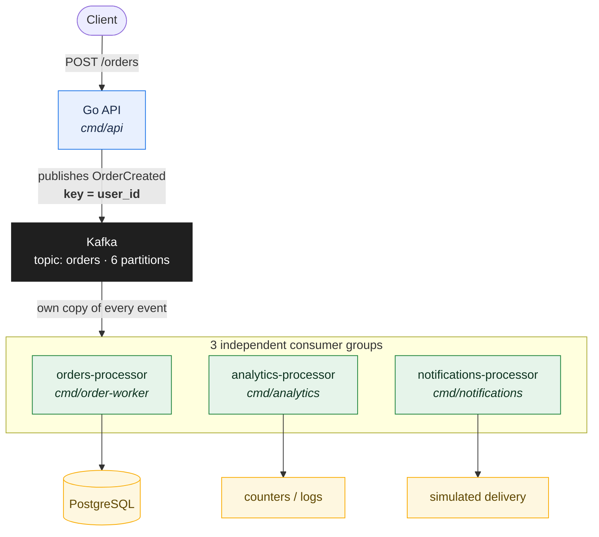

# kafka-practice

A small, event-driven order backend in Go, built around Apache Kafka. An HTTP API accepts orders, publishes `OrderCreated` events to a Kafka topic, and three independent consumer services process the same event stream in parallel — one persisting orders to PostgreSQL, one aggregating analytics, one simulating notifications.

The project exists to make Kafka's core mechanics — partitions, offsets, consumer groups, ordering, delivery guarantees, replay — visible and observable in a working system, rather than theoretical. It is intentionally simple; the point is the event-driven architecture, not the e-commerce logic.

---

## Architecture



- The API never talks to the consumers. It publishes an event and returns; Kafka decouples the two sides.
- Each consumer group receives **its own copy** of every event. Consuming an event in one group does not remove it from the topic for another group — this is what makes Kafka a distributed log rather than a message queue.
- Within a group, partitions are distributed across consumers, so scaling means running more instances of the same binary.

The same image contains all four service binaries; Docker Compose decides which one each container runs. A CLI seed producer is kept alongside the API for load generation.

---

## Components

| Service | Consumer group | Responsibility |
|---|---|---|
| `cmd/api` | — | HTTP entry point. Validates requests, generates event identity, publishes `OrderCreated`. |
| `cmd/order-worker` | `orders-processor` | Persists every event to PostgreSQL, then commits the Kafka offset. |
| `cmd/analytics` | `analytics-processor` | Consumes independently, maintains in-memory order counters. |
| `cmd/notifications` | `notifications-processor` | Consumes independently, simulates notification delivery. |
| `cmd/producer` | — | CLI load generator (not part of the runtime stack). Kept for benchmarks and replay experiments. |

Infrastructure: a single Kafka broker in KRaft mode (no ZooKeeper), a PostgreSQL 17 database, all wired through Docker Compose.

---

## The event

One shared event type, defined in `internal/event`, serialized as JSON:

```json
{
  "event_id":   "7178b1f3-aca1-49e7-a7ab-d50757a7ac4a",
  "order_id":   "dcc5627c-4c30-47cb-a2a1-dd3d47776dbe",
  "user_id":    "user-42",
  "item":       "laptop",
  "quantity":   1,
  "created_at": "2026-09-29T11:02:05.533339751Z"
}
```

The API generates `event_id`, `order_id` and `created_at`; the client supplies `user_id`, `item` and `quantity`. `event_id` is the deduplication identity used downstream.

---

## Kafka as the backbone

**A durable log, not a queue.** Messages are appended, retained, and replayable. Consumption never deletes data; a consumer group's committed offset is just its recorded position. A brand-new group can read the entire history without affecting any other group.

**Partitions are the unit of parallelism and ordering.** The `orders` topic has 6 partitions. Kafka guarantees ordering only *within* a partition, never across a topic — so the producer picks partitions deliberately.

**The message key decides the partition.** The producer uses the **user ID** as the key with a hash balancer:

```go
Balancer: &kafka.Hash{}
Key:      []byte(order.UserID)
```

Every event for `user-42` hashes to the same partition, so that user's events stay ordered. Different users may share a partition; that's fine. An earlier load-based balancer (`LeastBytes`) was deliberately replaced: it balances by bytes but destroys key-to-partition stability.

There are two distinct "balancing" problems, and Kafka solves them at different layers:

```text
producer → partition   : hash of the message key
partition → consumer   : consumer-group assignment (Kafka-managed)
```

**Kafka is not a database.** There is no query engine and no mutable state — it is an append-only event log for moving facts between services. Postgres holds the application state; Kafka holds the event stream that produced it.

---

## Reliability contract

Delivery semantics here are **at-least-once**, made safe by idempotent persistence:

```text
fetch message → decode → INSERT into PostgreSQL → commit offset
```

The offset is committed **only after** the database write succeeds. Committing first would let a message be considered processed even if persistence failed; processing first means a crash before the commit causes a redelivery, which the database absorbs.

| Failure | Behavior | Why it's safe |
|---|---|---|
| Crash between insert and commit | Message redelivered on restart | `event_id` is the primary key; `ON CONFLICT (event_id) DO NOTHING` makes the duplicate insert a no-op |
| Database unreachable | Insert retried 5× with backoff, then the worker stops **without committing** | The uncommitted message is redelivered on restart instead of being skipped; a later commit can never "leapfrog" a failed insert |
| Undecodable message | Logged, explicitly committed, skipped | A poison message can't wedge the partition forever |
| Transient fetch errors / rebalances | Logged, loop continues | Rebalances and broker blips don't kill the process |
| SIGTERM / Ctrl+C | Fetch loop stops; the in-flight message finishes (insert + commit), then the process exits | Docker can restart workers without losing or duplicating work |

Every service handles SIGINT/SIGTERM via `signal.NotifyContext`; the API uses `http.Server.Shutdown` with a grace period before closing its Kafka writer.

---

## Running the full stack

```bash
cp .env.example .env    # then fill in the secrets
docker compose up -d --build
```

This starts six containers: `kafka`, `postgres`, and the four Go services (`api`, `order-worker`, `analytics`, `notifications`). Kafka and PostgreSQL expose healthchecks; the Go services are gated on `service_healthy` and restarted on failure, so startup races between the broker, the database, and the apps are handled by Compose rather than luck.

Verify:

```bash
docker compose ps

curl -X POST localhost:8080/orders \
  -H 'Content-Type: application/json' \
  -d '{"user_id":"user-42","item":"laptop","quantity":1}'

docker compose logs order-worker analytics notifications --tail 5
docker exec kafka-postgres psql -U postgres -d orders -c 'SELECT count(*) FROM orders;'
```

`docker compose down` keeps volumes; `docker compose down -v` resets Kafka and PostgreSQL state completely.

Note: `schema.sql` is mounted into `/docker-entrypoint-initdb.d/` and runs only when PostgreSQL initializes a **fresh** volume. If you reset volumes, the schema is created automatically; against an existing volume it must be applied manually.

### Clean test runs: starting consumer groups from the beginning

For an end-to-end test you usually want every service to see every event from offset 0. Two things decide where a group starts:

- A group **with committed offsets** always resumes from them — that is the failure-recovery behavior, and it is never overridden by configuration.
- A group **without committed offsets** (fresh group, or after a reset) starts at `KAFKA_START_OFFSET`: `first` (default) reads the whole topic from the beginning, `last` skips the backlog and consumes only new events.

To run a clean test from the beginning, either wipe the state (`docker compose down -v`) or reset only the group offsets and restart the consumers:

```bash
for g in orders-processor analytics-processor notifications-processor; do
  docker exec kafka kafka-consumer-groups --bootstrap-server localhost:9092 \
    --group $g --reset-offsets --to-earliest --topic orders --execute
done
docker compose restart order-worker analytics notifications
```

---

## Running services on the host (development mode)

The Kafka broker advertises two listeners: `localhost:9092` for processes on the host, `kafka:29092` for containers. The service binaries default to the host addresses, so plain `go run` works against the same broker the containers use:

```bash
go run ./cmd/api
go run ./cmd/order-worker          # add WORKER_ID=w2 to run a second instance
go run ./cmd/producer --count 10000 --users 100
```

Consumer-group semantics make this safe: two `order-worker` processes — or one host process plus the container — share the `orders-processor` group, and Kafka splits the six partitions between them.

---

## Configuration

All values come from the environment with sane fallbacks (`internal/config`); nothing is hardcoded per-environment.

| Variable | Used by | Host default | In Compose |
|---|---|---|---|
| `KAFKA_BROKERS` | all services | `localhost:9092` | `kafka:29092` |
| `KAFKA_TOPIC` | all | `orders` | `orders` |
| `KAFKA_START_OFFSET` | the three consumers | `first` | `${KAFKA_START_OFFSET:-first}` |
| `DATABASE_URL` | order-worker | `postgres://…@localhost:5432/orders` | `postgres://…@postgres:5432/orders` |
| `API_ADDR` | api | `:8080` | `:8080` |
| `POSTGRES_USER` / `POSTGRES_PASSWORD` / `POSTGRES_DB` | postgres container | — | from `.env` |
| `WORKER_ID` | order-worker | hostname-pid | hostname-pid |

Consumer group IDs (`orders-processor`, `analytics-processor`, `notifications-processor`) are intentionally **not** configurable: group identity is what separates the three services, and a shared variable would let one misconfiguration silently merge them into a single group.

`KAFKA_START_OFFSET` is the one shared consumer knob, and it is safe to change: it only decides where a group starts when it has **no committed offset** (a fresh group, or after a volume reset). Groups that already committed offsets always resume from those offsets, so normal operation and failure recovery are unaffected.

---

## Observing the system

```bash
# topic layout and partition state
docker exec kafka kafka-topics --describe --topic orders \
  --bootstrap-server localhost:9092

# consumer progress and lag per partition
docker exec kafka kafka-consumer-groups \
  --bootstrap-server localhost:9092 --describe --group orders-processor

# group membership (who owns which partitions)
docker exec kafka kafka-consumer-groups \
  --bootstrap-server localhost:9092 --describe --group orders-processor --members --verbose

# replay the entire topic through an independent reader
docker exec kafka kafka-console-consumer \
  --bootstrap-server localhost:9092 --topic orders --from-beginning
```

Useful experiments that fall out of the design:

- **Scaling:** seed a backlog (`--count 10000`), start a slow second worker, and watch partitions rebalance and lag drop faster.
- **Ordering:** produce several events for one `user_id` and observe they always land on the same partition, in order.
- **Failure recovery:** kill a worker mid-stream; on restart it resumes from the group's committed offset, not from scratch.
- **Replay:** point a fresh group at the topic with `StartOffset: FirstOffset` and re-read the whole history without affecting other groups.
- **Delivery semantics:** kill a worker between insert and commit; the same event is redelivered, and the `event_id` primary key keeps the database clean.

---

## Repository layout

```text
kafka-practice/
├── cmd/
│   ├── api/             # HTTP entry point, produces OrderCreated
│   ├── producer/        # CLI seed / load generator
│   ├── order-worker/    # orders-processor group → PostgreSQL
│   ├── analytics/       # analytics-processor group
│   └── notifications/   # notifications-processor group
├── internal/
│   ├── event/           # shared OrderCreated event
│   └── config/          # env-with-fallback helper
├── schema.sql           # database schema (init-mounted into postgres)
├── Dockerfile           # multi-stage build: one image, four binaries
├── docker-compose.yml   # full stack, healthchecks, dual-listener Kafka
├── .dockerignore
├── .env.example         # variable template (real .env is gitignored)
└── go.mod
```

---

## Design decisions

| Decision | Rationale |
|---|---|
| `user_id` as the Kafka message key | Same user → same partition → per-user event ordering, while different users spread across partitions |
| `Hash` balancer over `LeastBytes` | Deterministic key→partition mapping; `LeastBytes` balances load but breaks key affinity |
| One consumer group per service | Groups broadcast events to every service; one shared group would load-balance instead |
| Commit offset after persistence | Committing first risks marking a message processed when the database write failed |
| `event_id` UUID primary key + `ON CONFLICT DO NOTHING` | Makes at-least-once redelivery harmless; duplicates never create duplicate rows |
| `StartOffset: FirstOffset` on fresh groups (`KAFKA_START_OFFSET`, default `first`) | New groups replay retained history from the beginning — or skip the backlog with `last`; committed groups always resume from their offset regardless |
| Synchronous producer writes | Every publish waits for the broker ack — the durable baseline; batching/compression remain available for load experiments |
| Single image, four binaries, Compose-selected command | One build, one image, minimal duplication across services |
| Single broker, KRaft mode | Enough to exercise all consumer-side mechanics without multi-broker operational overhead |

---

## Deliberately out of scope

Multi-broker clusters and replication, Schema Registry (Avro/Protobuf), Kafka Streams and Kafka Connect, Kubernetes, real email/SMS providers, a dedicated analytics store, Redis, auth, and a full observability stack. Each is a natural next step; none is needed for the core system to be understandable.

## Known sharp edges

- `docker compose down -v` wipes **both** Kafka and PostgreSQL state; Postgres rebuilds its schema from `schema.sql`, Kafka starts empty.
- The Postgres init script only runs on a **fresh** volume — editing `schema.sql` does not migrate an existing database.
- Deleting and recreating a topic while consumers are running can leave kafka-go readers idle on stale group metadata; restart the affected consumers.
- Kafka and PostgreSQL state are independent: truncating the database does not clear the topic, and resetting the topic does not touch the database. Keep both clean when benchmarking.
